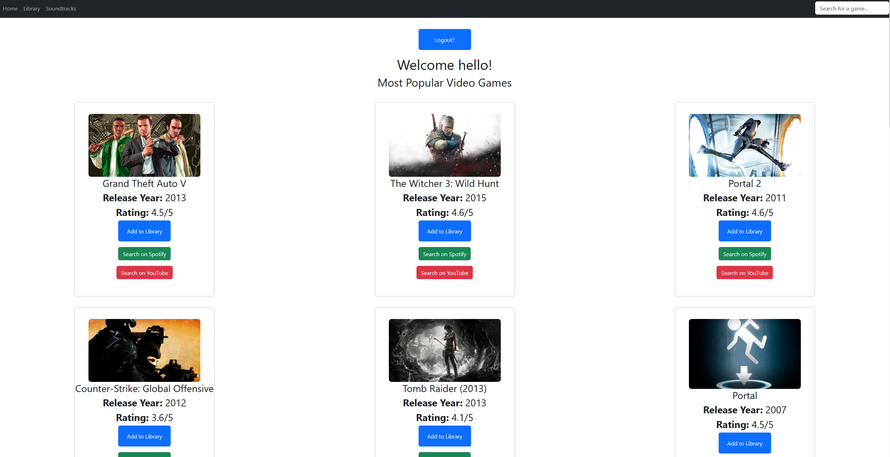
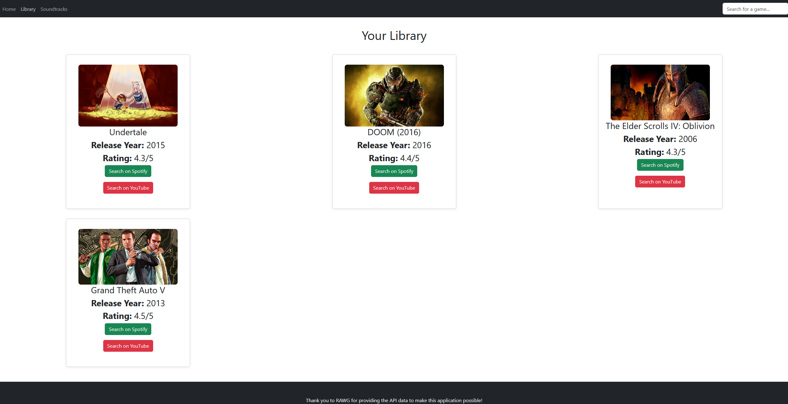
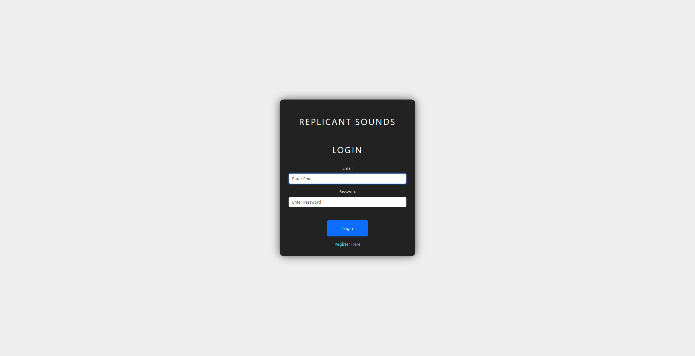

# Replicant Sounds

Replicant Sounds displays the most popular video games and lets you quickly search for their soundtracks on Spotify or YouTube. It also allows users to add their favourite video game soundtracks to a library and create their own profile. Built with ReactJs, Vite, MySQL, Express, NodeJs, React Query, JWT, bcrypt, Bootstrap, and the RAWG Video Games Database API.

---

## Features

- **Popular Games:** View a grid of the most popular video games with images, release year, ratings. It also includes auto-searches for the games soundtrack, which will redirect you to the apps when the buttons are pressed.
- **Responsive UI:** Clean, responsive layout using Bootstrap and custom CSS.
- **Navigation:** Simple navbar for Home, Library, and Soundtracks pages.
- **Search Functionality:** Users can search for games they like using the search bar.
- **User Authenthication**: Users create an account for the app, login and logout.
- **Library Page** Users can now add video games soundtracks to their Library and view them on the library page.

---

## Upcoming Features

- **User Profile:** Users will be able to create their own accounts and add game soundtracks they like to their own library.
- **Soundtracks Page:** The soundtracks page will display popular video game soundtracks right now, and most recent soundtrack releases
- **Spotify Integration:** You will be able to add music from your library to Spotify seemlessly.
- **CRUD Functionality:** Users will be able to remove video game music from their library, update their user profile and more.
 
## Screenshots

**Current Build:**








---

## Getting Started

### Prerequisites

- **Node.js** (v16+ recommended)
- **npm**
- **MySQL** (running locally or remotely)
- **RAWG API Key** (get one for free at [RAWG API Docs](https://rawg.io/apidocs))

### Installation

1. **Clone the repository:**
   ```sh
   git clone https://github.com/yourusername/video-game-music-app.git
   cd video-game-music-app
   ```

2. **Install dependencies for both client and server:**
   ```sh
   cd client
   npm install
   cd ../server
   npm install
   cd ..
   ```

3. **Set up environment variables:**

   - **Client:**  
     Create a `.env` file in the `client` directory:
     ```
     VITE_API_KEY=your_rawg_api_key_here
     ```
     You can copy `.env.example` as a template.

   - **Server:**  
     Create a `.env` file in the `server` directory:
     ```
     DB_HOST=your_host
     DB_USER=your_username
     DB_PASSWORD=your_password
     DB_NAME=your_database_name
     DB_PORT=your_db_port
     JWT_SECRET=your_jwt_key
     ```
     You can copy `.env.example` as a template.

4. **Set up your MySQL database:**
   - Create a database and the required tables (`users`, `library`, etc.) as described in backend code.
   - Make sure your credentials in `.env` match your MySQL setup.

5. **Start the backend server:**
   ```sh
   cd server
   npm run dev
   ```

6. **Start the frontend development server:**
   ```sh
   cd ../client
   npm run dev
   ```

7. **Open in your browser:**
   - Visit [http://localhost:5173](http://localhost:5173)

---

## Technologies Used

- [React](https://react.dev/)
- [Vite](https://vitejs.dev/)
- [MySQL](https://www.mysql.com/)
- [ExpressJs](https://expressjs.com/)
- [NodeJs](https://nodejs.org/en)
- [React Query](https://tanstack.com/query/latest)
- [Bootstrap](https://getbootstrap.com/)
- [RAWG Video Games Database API](https://rawg.io/apidocs)
- [Bcrypt](https://www.npmjs.com/package/bcrypt)
- [JWT](https://www.npmjs.com/package/jsonwebtoken)

---

## Credits

- Game data provided by [RAWG Video Games Database API](https://rawg.io/apidocs).

---

## Disclaimer

- This app is for educational/demo purposes.
