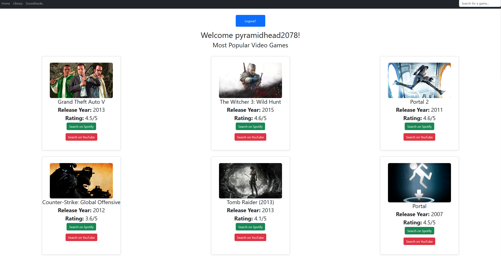
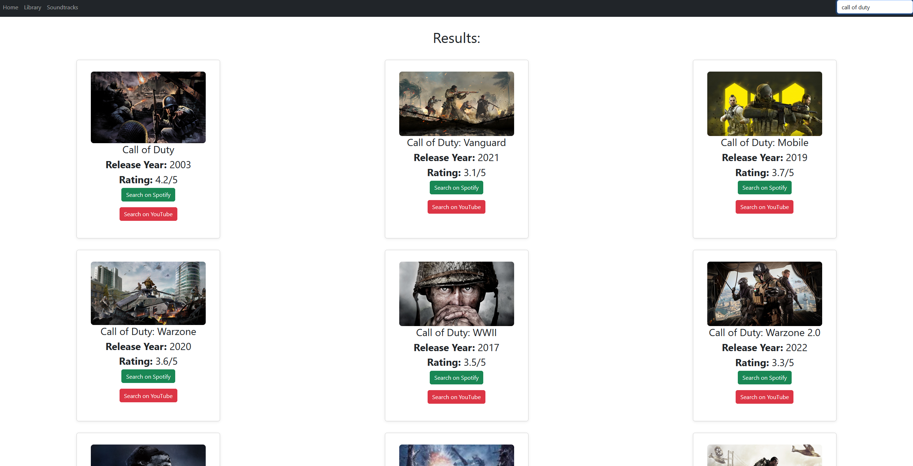

# Video Game Music App

A React web application that displays the most popular video games and lets you quickly search for their soundtracks on Spotify or YouTube. Built with ReactJs, Vite, MySQL, Express, NodeJs, React Query, JWT, bcrypt, Bootstrap, and the RAWG Video Games Database API.

---

## Features

- **Popular Games:** View a grid of the most popular video games with images, release year, ratings. It also includes auto-searches for the games soundtrack, which will redirect you to the apps when the buttons are pressed.
- **Responsive UI:** Clean, responsive layout using Bootstrap and custom CSS.
- **Navigation:** Simple navbar for Home, Library, and Soundtracks pages.
- **Search Functionality:** Users can search for games they like using the search bar and add them to their library.
- **User Authenthication**: Users create an account for the app and login (note: This feature is in progress and more will be implemented soon, such as a logout feature).

---

## Upcoming Features

- **User Profile:** Users will be able to create their own accounts and add game soundtracks they like to their own library.
- **Soundtracks Page:** The soundtracks page will display popular video game soundtracks right now, and most recent soundtrack releases
- **Spotify Integration:** You will be able to add music from your library to Spotify seemlessly.
- **CRUD Functionality:** Users will be able to remove video game music from their library, update their user profile and more.
 
## Screenshots

**Current Home Page:**






---

## Getting Started

### Prerequisites

- Node.js (v16+ recommended)
- npm

### Installation

1. **Clone the repository:**
   ```sh
   git clone https://github.com/yourusername/video-game-music-app.git
   cd video-game-music-app
   ```

2. **Install dependencies:**
   ```sh
   npm install
   ```

3. **Set up your API key:**
   - Create a `.env` file in the root directory:
     ```
     VITE_API_KEY=your_rawg_api_key_here
     ```
   - You can get a free API key from [RAWG](https://rawg.io/apidocs).

4. **Start the development server:**
   ```sh
   npm run dev
   ```

5. **Open in your browser:**
   - Visit [http://localhost:5173](http://localhost:5173)

---

## Technologies Used

- [React](https://react.dev/)
- [Vite](https://vitejs.dev/)
- [MySQL](https://www.mysql.com/)
- [ExpressJs](https://expressjs.com/)
- [NodeJs](https://nodejs.org/en)
- [React Query](https://tanstack.com/query/latest)
- [Bootstrap](https://getbootstrap.com/)
- [RAWG Video Games Database API](https://rawg.io/apidocs)
- [Bcrypt](https://www.npmjs.com/package/bcrypt)
- [JWT](https://www.npmjs.com/package/jsonwebtoken)

---

## Credits

- Game data provided by [RAWG Video Games Database API](https://rawg.io/apidocs).

---

## Disclaimer

- This app is for educational/demo purposes.
